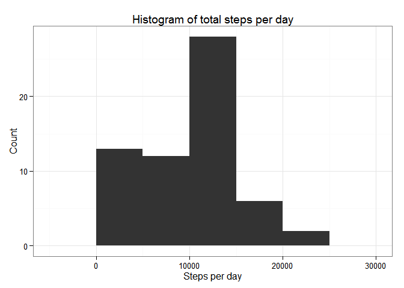
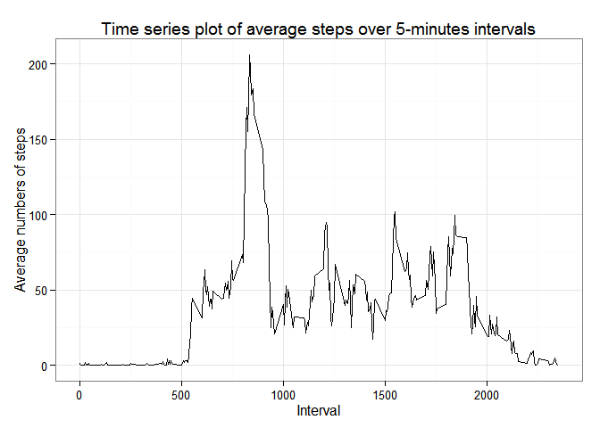
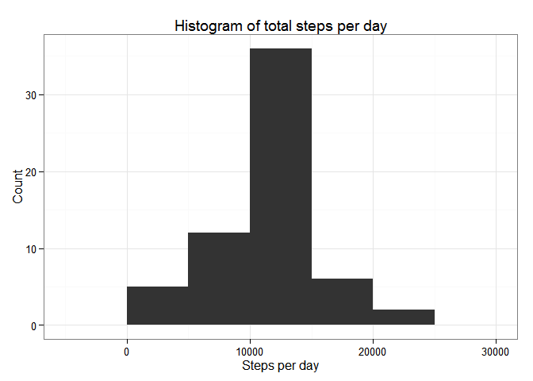
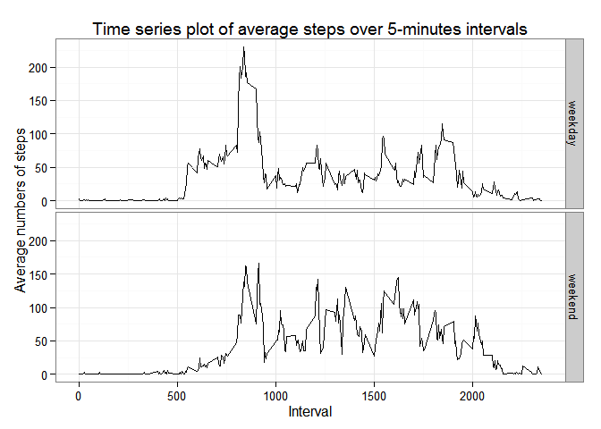

# Reproducible Research: Peer Assessment 1

This assignment makes use of data from a personal activity monitoring
device. This device collects data at 5 minute intervals through out the
day. The data consists of two months of data from an anonymous
individual collected during the months of October and November, 2012
and include the number of steps taken in 5 minute intervals each day.


### 1. Loading and preprocessing the data

```r
library(ggplot2)
library(dplyr)

## Load data
activitydata <- read.csv("activity.csv", stringsAsFactors = FALSE)
activitydata$date <- as.Date(activitydata$date, "%Y-%m-%d")

## Show the first six lines of the data
head(activitydata)
```

```
##   steps       date interval
## 1    NA 2012-10-01        0
## 2    NA 2012-10-01        5
## 3    NA 2012-10-01       10
## 4    NA 2012-10-01       15
## 5    NA 2012-10-01       20
## 6    NA 2012-10-01       25
```

### 2. What is mean total number of steps taken per day?

```r
## Calculate total number of steps taken per day
dailysteps <- tapply(activitydata$steps, activitydata$date, sum, na.rm = TRUE)
dailysteps
```

```
## 2012-10-01 2012-10-02 2012-10-03 2012-10-04 2012-10-05 2012-10-06 
##          0        126      11352      12116      13294      15420 
## 2012-10-07 2012-10-08 2012-10-09 2012-10-10 2012-10-11 2012-10-12 
##      11015          0      12811       9900      10304      17382 
## 2012-10-13 2012-10-14 2012-10-15 2012-10-16 2012-10-17 2012-10-18 
##      12426      15098      10139      15084      13452      10056 
## 2012-10-19 2012-10-20 2012-10-21 2012-10-22 2012-10-23 2012-10-24 
##      11829      10395       8821      13460       8918       8355 
## 2012-10-25 2012-10-26 2012-10-27 2012-10-28 2012-10-29 2012-10-30 
##       2492       6778      10119      11458       5018       9819 
## 2012-10-31 2012-11-01 2012-11-02 2012-11-03 2012-11-04 2012-11-05 
##      15414          0      10600      10571          0      10439 
## 2012-11-06 2012-11-07 2012-11-08 2012-11-09 2012-11-10 2012-11-11 
##       8334      12883       3219          0          0      12608 
## 2012-11-12 2012-11-13 2012-11-14 2012-11-15 2012-11-16 2012-11-17 
##      10765       7336          0         41       5441      14339 
## 2012-11-18 2012-11-19 2012-11-20 2012-11-21 2012-11-22 2012-11-23 
##      15110       8841       4472      12787      20427      21194 
## 2012-11-24 2012-11-25 2012-11-26 2012-11-27 2012-11-28 2012-11-29 
##      14478      11834      11162      13646      10183       7047 
## 2012-11-30 
##          0
```

```r
## Histogram of total steps per day
qplot(dailysteps, geom = "histogram", binwidth = 5000, 
      main = "Histogram of total steps per day", 
      xlab = "Steps per day", ylab = "Count") +
        theme_bw(base_size = 12)
```

 

```r
## Calculate mean and median of the total number of steps take per day
dailysteps_mean <- round(mean(dailysteps), digits =0)
dailysteps_median <- median(dailysteps)
```

**The mean of the total numbers of steps taken per day is 9354. The median of the total numbers of steps taken per day is 10395.**


### 3. What is the average daily activity pattern?

```r
## Calculate the average number of steps per interval
intervalaverage <- activitydata %>%
        group_by(interval) %>% summarise(steps = mean(steps, na.rm = TRUE))

## Time series plot
qplot(interval, steps, data = intervalaverage, geom = "line", 
      xlab= "Interval", ylab = "Average numbers of steps",
      main = "Time series plot of average steps over 5-minutes intervals") +
        theme_bw(base_size = 12)
```

 

```r
## Which interval has the highest avearge numbers of steps
interval_highest <- intervalaverage[intervalaverage$steps == max(intervalaverage$step), 1]
interval_higheststeps <- round(intervalaverage[intervalaverage$steps == max(intervalaverage$step), 2], digits = 0)
```
**The interval with the highest average number of steps is the interval 835, which has average 206 steps.**


### 4. Imputing missing values

```r
options(scipen=8)
## Calculate total number of missing data
missing <- sum(is.na(activitydata$steps))
print(paste("There are total", missing, "missing data"))
```

```
## [1] "There are total 2304 missing data"
```

```r
## Split the original dataset into the good data and the missing data 
index <- is.na(activitydata$steps)
gooddata <- activitydata[!index,]
baddata <- activitydata[index,]

## Replace the missing steps with the average steps of that interval
for(i in 1:nrow(baddata)){
        whichinterval <- which(intervalaverage$interval == baddata[i, 3])
        ## the missing value is replaced by the rounded number
        baddata[i, 1] = round(intervalaverage[whichinterval,2],digits = 0)
}
## Create a new dataset to fill in the missing value with average steps of that interval
newdata <- rbind(gooddata, baddata)

## Calculate total number of steps taken per day for newdata
newdailysteps <- tapply(newdata$steps, newdata$date, sum)
newdailysteps
```

```
## 2012-10-01 2012-10-02 2012-10-03 2012-10-04 2012-10-05 2012-10-06 
##      10762        126      11352      12116      13294      15420 
## 2012-10-07 2012-10-08 2012-10-09 2012-10-10 2012-10-11 2012-10-12 
##      11015      10762      12811       9900      10304      17382 
## 2012-10-13 2012-10-14 2012-10-15 2012-10-16 2012-10-17 2012-10-18 
##      12426      15098      10139      15084      13452      10056 
## 2012-10-19 2012-10-20 2012-10-21 2012-10-22 2012-10-23 2012-10-24 
##      11829      10395       8821      13460       8918       8355 
## 2012-10-25 2012-10-26 2012-10-27 2012-10-28 2012-10-29 2012-10-30 
##       2492       6778      10119      11458       5018       9819 
## 2012-10-31 2012-11-01 2012-11-02 2012-11-03 2012-11-04 2012-11-05 
##      15414      10762      10600      10571      10762      10439 
## 2012-11-06 2012-11-07 2012-11-08 2012-11-09 2012-11-10 2012-11-11 
##       8334      12883       3219      10762      10762      12608 
## 2012-11-12 2012-11-13 2012-11-14 2012-11-15 2012-11-16 2012-11-17 
##      10765       7336      10762         41       5441      14339 
## 2012-11-18 2012-11-19 2012-11-20 2012-11-21 2012-11-22 2012-11-23 
##      15110       8841       4472      12787      20427      21194 
## 2012-11-24 2012-11-25 2012-11-26 2012-11-27 2012-11-28 2012-11-29 
##      14478      11834      11162      13646      10183       7047 
## 2012-11-30 
##      10762
```

```r
## Histogram of total steps per day
qplot(newdailysteps, geom = "histogram", binwidth = 5000, 
      main = "Histogram of total steps per day", 
      xlab = "Steps per day", ylab = "Count") +
        theme_bw(base_size = 12)
```

 

```r
## Calculate mean and median of the total number of steps take per day
newdailysteps_mean <- round(mean(newdailysteps), digits =0)
newdailysteps_median <- median(newdailysteps)
```
**Imputing missing data changed the distribution of total steps per day. Now the mean of the total numbers of steps taken per day is 10766. The median of the total numbers of steps taken per day is 10762.**


### 5. Are there differences in activity patterns between weekdays and weekends?

```r
## Create a new variable with 2 levels "weekday" & "weekend"
weekday <- c("Monday", "Tuesday","Wednesday","Thursday", "Friday")
newdata2 <- mutate(newdata, 
                   day = ifelse(weekdays(date) %in% weekday, 
                                "weekday", "weekend"))

## Calculate the average number of steps per interval
wkdayaverage <- newdata2 %>%
        group_by(day, interval) %>% summarise(steps = mean(steps))


## Time series plot
qplot(interval, steps, data = wkdayaverage, geom = "line", 
      facets = day~.,
      xlab= "Interval", ylab = "Average numbers of steps",
      main = "Time series plot of average steps over 5-minutes intervals") +
        theme_bw(base_size = 12)
```

 

**As shown in the plot, the time series pattern of numbers of steps are different in weekdays and weekends.**
